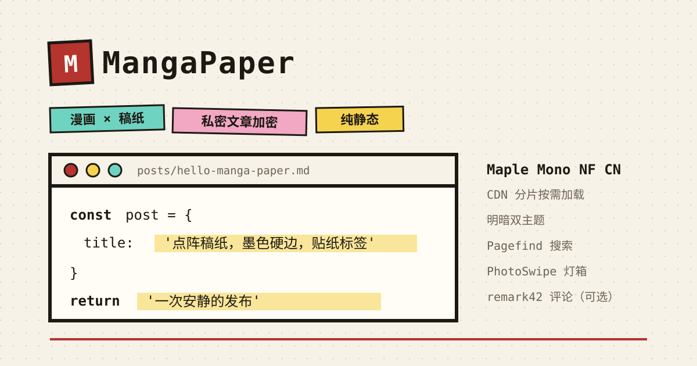

# MangaPaper 🖋



[](https://conventionalcommits.org)

[简体中文](README.md) · **English**

MangaPaper is a **comic-paper** themed open-source blog template: dotted notebook paper, ink-black hard borders,
offset hard shadows, slapped-on sticker labels — with a full monospace type system (Maple Mono NF CN) and
light/dark themes. Fully static: no backend, no client framework.

## 🔥 Features

- [x] Paper × comic design language, monospace everywhere
- [x] **Private posts**: AES-256-GCM encrypted at build time; only ciphertext ships; `/private` gated index
- [x] Table of contents (sticky right rail, scroll highlighting with vermilion indicator)
- [x] Homepage Featured paper-stack carousel
- [x] static search ([Pagefind](https://pagefind.app/), CJK-friendly)
- [x] Archive timeline / tag cloud / category pages
- [x] draft posts & pagination (8 per page)
- [x] sitemap & rss feed (private and draft posts excluded)
- [x] Comments ([remark42](https://remark42.com/), optional — not rendered unless configured)
- [x] Automatic dates: a git hook injects `date` and refreshes `updated`
- [x] One-click deploy (Vercel / Cloudflare Pages)

## 🚀 Project Structure

```bash
/
├── public/
│   ├── default-og.svg          # README hero / social preview
│   └── favicon.svg             # vermilion seal
├── scripts/
│   ├── frontmatter-dates.ts    # git hook: inject date / refresh updated
│   └── verify-dist.ts          # build-output assertions (npm run verify)
├── src/
│   ├── components/             # PostCard / FeaturedStack / TableOfContents / Comments …
│   ├── content/blog/           # posts: first-level directory name = category
│   ├── layouts/Base.astro      # dotted paper background, theme toggle, header & footer
│   ├── pages/                  # index / posts / archive / tags / category / search / private / rss
│   ├── plugins/                # rehype image sizing, content scanning
│   ├── scripts/                # lightbox, TOC, private unlock & key cache (client-side)
│   ├── styles/                 # global / fonts / card / prose / private / lightbox
│   ├── utils/                  # content pipeline, crypto, formatting, reading time
│   ├── config.ts               # site name / author / remark42 (single source of truth)
│   └── content.config.ts       # content schema (zod)
└── astro.config.mjs
```

All posts live in `src/content/blog/`; the **first-level directory name becomes the category**
(`blog/tech/hello.md` → category “tech”), and the filename becomes the URL slug.

## 💻 Tech Stack

- **Framework** — [Astro](https://astro.build/) (`output: 'static'`, no SSR adapter)
- **Source language** — TypeScript (Node native type stripping — no build step before running)
- **Fonts** — [Maple Mono NF CN](https://github.com/subframe7536/maple-font) (OFL-1.1) via [ZeoSeven Fonts CDN](https://fonts.zeoseven.com/items/442/)
- **Static search** — [Pagefind](https://pagefind.app/)
- **Lightbox** — [PhotoSwipe](https://photoswipe.com/)
- **Comments** — [remark42](https://remark42.com/) (self-hosted, optional)
- **Encryption** — WebCrypto (PBKDF2 600k + AES-256-GCM)
- **Git hooks** — [husky](https://typicode.github.io/husky/)
- **Deployment** — [Cloudflare Pages](https://pages.cloudflare.com/) or [Vercel](https://vercel.com/) (choose one)

## 👨🏻‍💻 Running Locally

Requires **Node ≥ 22** (see `.nvmrc`).

```bash
# Option 1: clone directly (for theme development)
git clone https://github.com/lavieio/manga-paper-template.git my-blog
cd my-blog && npm install

# Option 2: use this repo as a template (for blogging; pick Private)
# https://github.com/lavieio/manga-paper-template/generate

cp .env.example .env          # fill in as needed — see Environment Variables
npm run dev                   # http://localhost:4321
```

> Search has no index in dev mode (Pagefind runs after the build); the search page says so explicitly. That is expected.

## 🧞 Commands

All commands are run from the project root:

| Command | Action |
| :--------------- | :------------------------------------------------------------------- |
| `npm install` | Install dependencies (also installs the git hooks via husky) |
| `npm run dev` | Start the local dev server at `localhost:4321` |
| `npm run build` | Build the static site + generate the Pagefind index into `dist/` |
| `npm run preview` | Preview the build locally (search works here) |
| `npm test` | Unit/integration tests (date hook, crypto round-trip) |
| `npm run verify` | Assert build outputs: no private leakage, Pagefind page count, artifacts (run after build) |
| `npm run astro ...` | Astro CLI (e.g. `astro add`) |

## 📖 Writing Posts

```yaml
---
title: Title
description: Summary (used for SEO, RSS and cards)
tags: [tag, more-tags]
featured: true          # optional: add to the homepage featured carousel
draft: true             # optional: excluded from builds, no date injected
private: true           # optional: private post (see below)
cover: /cover.png       # optional
---
```

You never write `date` / `updated` — the git hook handles them on commit:

| Commit message | Behaviour |
| :--- | :--- |
| `feat(blog): publish "Title"` | New post gets `date`; edits refresh `updated` |
| `fix(blog): "Title" fix typos` | Silent: `updated` untouched (`chore` likewise) |
| any type with `[skip-updated]` | Force-skip the `updated` refresh |

Working tree, index and commit always stay in sync; partial staging (`git add -p`) is rejected;
the timezone is pinned to `Asia/Shanghai`.

## 🔒 Private Posts

1. Set `PRIVATE_PASSWORD` in `.env` (**change it to a strong password before going live**; it falls back to
   `manga-paper` with a build-time warning)
2. Add `private: true` to the post frontmatter
3. Readers open `/private` (linked from the footer), enter the password once, and see the full list plus content

- Encryption: PBKDF2 (SHA-256, 600,000 iterations) + AES-256-GCM; the key is derived **in the browser**, the password is never uploaded
- Private posts are excluded from lists / archive / tags / categories / RSS / sitemap / search index; pages are `noindex`
- The unlock is cached in localStorage for `PUBLIC_UNLOCK_TTL_HOURS` (default 1 hour)
- ⚠️ Prerequisite: the repository holding real posts **must be private**; a lost password cannot be recovered

## 🎨 Design Language

- **Dotted paper**: 1.2px ink dots on a 22px grid (repeating `radial-gradient`)
- **Hard edges**: 3px ink borders with `4px 4px 0` hard shadows (zero blur)
- **Sticker labels**: small type, ±1.5° rotation, per-category colours (tech=cyan / essays=pink / photo=yellow / else=blue)
- **Type**: Maple Mono NF CN everywhere; dark mode only swaps CSS variable values, never structure

## 🌐 Deployment

Both platforms consume the same `dist/`. **Deploy to one only** — no platform-specific config file is needed.

### Deploy to Vercel

[](https://vercel.com/new/clone?repository-url=https%3A%2F%2Fgithub.com%2Flavieio%2Fmanga-paper-template&project-name=manga-paper&repository-name=manga-paper&env=PRIVATE_PASSWORD,SITE_URL,PUBLIC_UNLOCK_TTL_HOURS&envDescription=PRIVATE_PASSWORD%20encrypts%20private%20posts%20%E2%80%94%20use%20a%20strong%20password%20before%20going%20live.%20SITE_URL%20is%20your%20real%20domain.%20PUBLIC_UNLOCK_TTL_HOURS%20is%20the%20unlock%20memory%20in%20hours%2C%20default%201.&envDefaults=%7B%22PUBLIC_UNLOCK_TTL_HOURS%22%3A%221%22%7D)

- **One-click** (the button above): sign in → the repo is copied into your account (pick **Private** if you plan
  to write private posts) → fill in the environment variables → deploy
- **Dashboard import**: Vercel → **Add New → Project**, pick the repo; Framework: Astro, Build Command `npm run build`,
  Output Directory `dist`, Node 22

You can also create the repo first via [**Use this template**](https://github.com/lavieio/manga-paper-template/generate)
(recommended: **Private**) and import it into Vercel afterwards.

### Deploy to Cloudflare Pages

1. Cloudflare dashboard → **Workers & Pages → Create → Pages → Connect to Git**, then pick your repo
2. Build settings: Build command `npm run build`, Output directory `dist`
3. Environment variables: at least `NODE_VERSION=22` (plus the others from the table below)
4. Save and deploy

### Environment Variables

| Variable | Purpose |
| :--- | :--- |
| `PRIVATE_PASSWORD` | Password for private-post encryption (build time; falls back to `manga-paper`, local use only) |
| `PUBLIC_UNLOCK_TTL_HOURS` | How long an unlock is remembered, in hours (default 1) |
| `SITE_URL` | Site root URL — the single source of truth for canonical / sitemap / RSS |
| `PUBLIC_REMARK42_HOST` / `PUBLIC_REMARK42_SITE_ID` | remark42 comments (optional; both required) |

`.env` is gitignored; `.env.example` ships with the repository.

## 📝 Comments (optional)

With `PUBLIC_REMARK42_HOST` / `PUBLIC_REMARK42_SITE_ID` configured, public posts render remark42 at the bottom:

- **Missing either one → the whole comment section is not rendered** (no empty shell); private posts never carry comments
- Lazy-loaded (the script is injected only when scrolled near); Chinese UI; **theme follows the site's light/dark**
- ⚠️ remark42 renders inside a cross-origin iframe (style isolation), so page CSS cannot reach it. Matching it fully
  to the paper look requires rewriting its stylesheet behind a reverse proxy, or rebuilding its frontend — out of scope here

## 🔤 Fonts

By default fonts come from the [ZeoSeven Fonts CDN](https://fonts.zeoseven.com/items/442/) (cn-font-split chunks,
OFL-1.1, hinted) — no font files to self-host. Only four weights are loaded (body 400 / italic 400i / stickers 600 /
headings 700), and they load **non-blocking** (`preload` + `onload` switching `rel`, with a `<noscript>` fallback).

To self-host instead: download Maple Mono NF CN, subset it yourself, emit `public/fonts/**`,
then swap the CDN `<link>` tags in `src/layouts/Base.astro` for local `@font-face` rules
(keep the metric-matched fallback in `src/styles/fonts.css`). ZeoSeven also ships a
[ZSFT CLI](https://fonts.zeoseven.com/docs/cli/) for private deployments. Offline, fonts fall back to
metric-adjusted Consolas.

## ✨ Feedback & Suggestions

Open an [issue](https://github.com/lavieio/manga-paper-template/issues) for feedback, bugs or feature requests.

## 📜 License

- Template code: [MIT](LICENSE)
- Font [Maple Mono NF CN](https://github.com/subframe7536/maple-font): **OFL-1.1**

---

Made with 🖤 by [lavieio](https://github.com/lavieio)
