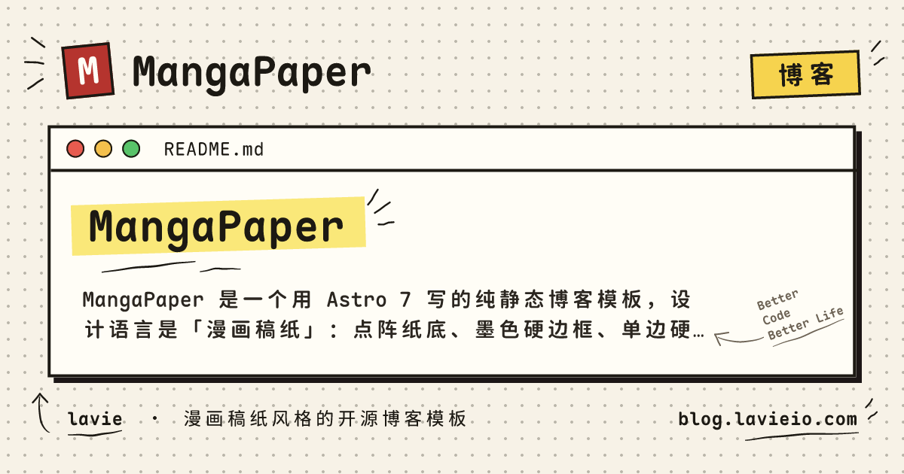

# MangaPaper 🖋



[](https://conventionalcommits.org)

**简体中文** · [English](README.en.md)

MangaPaper 是一个**漫画稿纸风格**的开源博客模板：点阵纸底、墨色硬边框、单边硬阴影、随手贴的彩色贴纸，
全站等宽字体（Maple Mono NF CN），明暗双主题。纯静态、零后端、零前端框架。

## 🔥 Features

- [x] 稿纸 × 漫画设计语言，全站等宽字体（完整字体进仓 + 构建期切子集：一篇文章 ≈1 MB / 3 个字体请求）
- [x] **私密文章**：构建期 AES-256-GCM 加密，页面只存密文；`/private` 加密入口页
- [x] 文章目录（右侧 sticky TOC，滚动高亮 + 朱砂指示条）
- [x] 代码块一键复制（构建期注入按钮 + 事件委托；公开与私密文章都有）
- [x] 图片灯箱（[PhotoSwipe](https://photoswipe.com/)，点击才加载）+ 构建期读图尺寸（站内读文件、外链读图头），无布局抖动
- [x] 首页 Featured 纸片堆轮播
- [x] static search（[Pagefind](https://pagefind.app/)，支持中文）
- [x] 归档时间轴 / 标签云 / 分类页
- [x] draft posts & pagination（每页 8 篇）
- [x] sitemap & rss feed（私密与草稿自动排除）
- [x] 分享卡片：每篇公开文章构建期渲染一张 1200×630 OG 图（[Satori](https://github.com/vercel/satori) + resvg-js；私密/草稿绝不生成）
- [x] 评论（[remark42](https://remark42.com/)，可选；未配置则整块不渲染）
- [x] 日期自动化：git 钩子注入 `date` / 刷新 `updated`
- [x] 一键部署（Vercel / Cloudflare Pages）

## 🚀 Project Structure

```bash
/
├── assets/
│   └── fonts/                  # 完整字体：上游 TTF + LICENSE（OFL-1.1；构建期从这里切子集）
├── public/
│   ├── fonts/                  # 字体子集产物（npm run fonts 生成，不进仓）
│   ├── og.png                  # README 头图（站点默认卡片的快照；卡片本体由 /og/*.png 构建期生成）
│   └── favicon.svg             # 朱砂印章
├── scripts/
│   ├── build-deploy-config.ts  # 生成 dist/_headers + dist/_redirects
│   ├── build-fonts.ts          # 生成自托管字体子集（npm run fonts）
│   ├── frontmatter-dates.ts    # git 钩子：date / updated 自动注入
│   └── preflight.ts            # 构建前必须通过的检查（目前是 SITE_URL）
├── src/
│   ├── components/             # PostCard / FeaturedStack / TableOfContents / Comments …
│   ├── content/blog/           # 文章：一级子目录名 = 分类
│   ├── layouts/Base.astro      # 布局：点阵稿纸底、主题切换、页头页脚
│   ├── pages/                  # index / posts / archive / tags / category / search / private / about / rss / og（分享卡片）
│   ├── plugins/                # rehype 图片尺寸/懒加载注入、代码复制按钮、私密与草稿扫描
│   ├── scripts/                # 灯箱、TOC、私密解锁与密钥缓存（客户端）
│   ├── styles/                 # global / fonts / card / prose / private / lightbox
│   ├── utils/                  # 内容管线、加密、格式与阅读时长、响应头策略、og 卡片（版式/文本/装饰/字体子集）
│   ├── config.ts               # 站名 / 作者 / 关于页文案与联系方式 / 页脚仓库链接 / remark42（唯一站点入口）
│   └── content.config.ts       # 内容 schema（zod）
├── vercel.ts                   # Vercel 项目配置（Vercel 构建时执行，自己读 env；不存生成物）
└── astro.config.mjs
```

所有文章放在 `src/content/blog/` 下，**一级子目录名即分类**（`blog/技术/xxx.md` → 分类「技术」），
文件名即 URL slug。

## 💻 Tech Stack

- **框架** — [Astro](https://astro.build/)（`output: 'static'`，无 SSR adapter）
- **源码语言** — TypeScript（Node 原生类型剥离，构建前无需编译步骤）
- **字体** — [Maple Mono NF CN](https://github.com/subframe7536/maple-font)（OFL-1.1，自托管子集）
- **静态搜索** — [Pagefind](https://pagefind.app/)
- **分享图** — [Satori](https://github.com/vercel/satori) + [resvg-js](https://github.com/thx/resvg-js)（构建期渲染，不进产物）
- **灯箱** — [PhotoSwipe](https://photoswipe.com/)
- **评论** — [remark42](https://remark42.com/)（自托管，可选）
- **观测** — [Google Analytics 4](https://analytics.google.com/)（可选）+ Vercel Web Analytics / Speed Insights（可选，仅 Vercel）
- **加密** — WebCrypto（PBKDF2 600k + AES-256-GCM）
- **Git 钩子** — [husky](https://typicode.github.io/husky/)
- **部署** — [Cloudflare Pages](https://pages.cloudflare.com/) 或 [Vercel](https://vercel.com/)（二选一）

## 👨🏻‍💻 Running Locally

要求 **Node ≥ 22**（见 `.nvmrc`）。

```bash
# 方式一：直接克隆（改主题用）
git clone https://github.com/lavieio/manga-paper-template.git my-blog
cd my-blog && npm install

# 方式二：以本仓为模板创建自己的仓库（写博客用，推荐 Private）
# GitHub 上打开 https://github.com/lavieio/manga-paper-template/generate 或点 README 的 Use this template

cp .env.example .env          # 必填 SITE_URL（本地预览可填 http://localhost:4321）
npm run dev                   # http://localhost:4321
```

> 开发模式下搜索无索引（Pagefind 在构建后产出），搜索页会给出明确提示——属正常现象。

## 🧞 Commands

所有命令在项目根目录执行：

| Command | Action |
| :--------------- | :------------------------------------------------------------------- |
| `npm install` | 安装依赖（会通过 husky 安装 git 钩子） |
| `npm run dev` | 本地开发服务器 `localhost:4321` |
| `npm run build` | 构建静态站 + 生成 Pagefind 索引 → `dist/`（SITE_URL 缺失或仍是示例域名会直接失败） |
| `npm run preview` | 预览构建产物（搜索在此可用） |
| `npm run astro ...` | Astro CLI（`astro add` 等） |

## 📖 写文章

```yaml
---
title: 标题
description: 摘要（用于 SEO、RSS 与卡片）
tags: [标签, 可以有多个]
featured: true          # 可选：进首页精选轮播
draft: true             # 可选：草稿，构建时排除且不注入 date
private: true           # 可选：私密文章（见下）
cover: /cover.png       # 可选
---
```

`date` / `updated` **不必手写**——提交时 git 钩子自动处理：

| 提交信息 | 行为 |
| :--- | :--- |
| `feat(blog): 发布《标题》` | 新文章注入 `date`；修改现有文章刷新 `updated` |
| `fix(blog): 《标题》修正错别字` | 静默：不刷新 `updated`（`chore` 同理） |
| 任意 type 加 `[skip-updated]` | 强制跳过 `updated` 刷新 |

工作区、暂存区、提交三者始终一致；`git add -p` 半成品暂存会被拒绝；时区固定 `Asia/Shanghai`。

## 🔒 私密文章

1. 在 `.env` 设置 `PRIVATE_PASSWORD`（**上线必须改成强密码**；缺省回落 `manga-paper` 并构建告警）
2. 文章 frontmatter 加 `private: true`
3. 访客从页脚「私密」进入 `/private` 入口页，输一次密码即可看完整列表与正文

- 加密：PBKDF2（SHA-256，600,000 次）+ AES-256-GCM，密钥在浏览器本地派生，**密码不上传**
- 私密文章不进列表 / 归档 / 标签 / 分类 / RSS / sitemap / 搜索索引；页面 `noindex`
- 解锁缓存在 localStorage，时长由 `PUBLIC_UNLOCK_TTL_HOURS` 控制（默认 1 小时）
- ⚠️ 前提：**承载真实文章的仓库必须私有**；密码丢失无法恢复

## 🎨 设计语言

- **点阵稿纸底**：22px 网格 1.2px 墨点（`radial-gradient` repeat）
- **硬边硬阴影**：3px 墨色实线边框 + `4px 4px 0` 单方向硬阴影（零高斯模糊）
- **贴纸标签**：小字、±1.5° 微旋、按内容分主题色（技术=青 / 随笔=粉 / 摄影=黄 / 其他=蓝）
- **字体**：Maple Mono NF CN 全站等宽；暗色只切换 CSS 变量值，不改结构

## 🌐 部署

两个平台共用同一份 `dist/`，**只部署其中一个**即可。

安全响应头两边都随 `.env` 走，只是入口不同：

- **Cloudflare Pages / Netlify** 读发布目录里的 `dist/_headers`，由 `scripts/build-deploy-config.ts` 构建期生成；
- **Vercel** 不认 `_headers`，读仓根的 **`vercel.ts`** —— 它在 Vercel 构建时执行，自己读环境变量。

两种写法都是「构建期拿到 env」时才成型的，所以**仓库里不存生成物**：
配了 remark42（`PUBLIC_REMARK42_HOST`）就自动放行它的域名，不用手改配置。

### Vercel 部署

[](https://vercel.com/new/clone?repository-url=https%3A%2F%2Fgithub.com%2Flavieio%2Fmanga-paper-template&project-name=manga-paper&repository-name=manga-paper&env=PRIVATE_PASSWORD,SITE_URL,PUBLIC_UNLOCK_TTL_HOURS&envDescription=PRIVATE_PASSWORD%20%E7%94%A8%E4%BA%8E%E7%A7%81%E5%AF%86%E6%96%87%E7%AB%A0%E5%8A%A0%E5%AF%86%EF%BC%8C%E4%B8%8A%E7%BA%BF%E5%8A%A1%E5%BF%85%E6%94%B9%E4%B8%BA%E5%BC%BA%E5%AF%86%E7%A0%81%EF%BC%9BSITE_URL%20%E5%A1%AB%E4%BD%A0%E7%9A%84%E7%9C%9F%E5%AE%9E%E5%9F%9F%E5%90%8D%EF%BC%9BPUBLIC_UNLOCK_TTL_HOURS%20%E6%98%AF%E8%A7%A3%E9%94%81%E8%AE%B0%E5%BF%86%E6%97%B6%E9%95%BF%EF%BC%88%E5%B0%8F%E6%97%B6%EF%BC%89%EF%BC%8C%E9%BB%98%E8%AE%A4%201%E3%80%82&envDefaults=%7B%22PUBLIC_UNLOCK_TTL_HOURS%22%3A%221%22%7D)

- **一键部署**（上面的按钮）：登录 → 把仓库复制到你的账号（要写私密文章请选 **Private**）→ 按提示填环境变量 → 部署
- **仪表盘导入**：Vercel → **Add New → Project** 选仓库；Framework 选 Astro，Build Command `npm run build`，Output Directory `dist`，Node 22

也可以先点 [**Use this template**](https://github.com/lavieio/manga-paper-template/generate) 在 GitHub 上建仓（推荐选 **Private**），再回到 Vercel 导入。

### Cloudflare Pages 部署

1. Cloudflare 仪表盘 → **Workers & Pages → Create → Pages → Connect to Git**，选中你的仓库
2. 构建设置：Build command `npm run build`，Output directory `dist`
3. 环境变量：至少加 `NODE_VERSION=22`（以及环境变量表中的其它项）
4. 保存并部署

### 安全响应头

开箱即用的头：HSTS、`X-Content-Type-Options`、`Referrer-Policy`、`X-Frame-Options`、`Permissions-Policy`，
以及一份 **`Content-Security-Policy-Report-Only`**。策略写在 `src/utils/deploy-policy.ts`（唯一来源），
两个出口对应两个平台的读法：构建期生成 `dist/_headers`（Cloudflare Pages / Netlify 读发布目录），
仓根 `vercel.ts` 在 Vercel 构建时执行（Vercel 不认 `_headers`）。两边对不上时 `npm run verify` 会红。

**CSP 白名单跟着 `.env` 走**：配了 remark42（`PUBLIC_REMARK42_HOST`）就自动把它的域名写进
`script-src` / `connect-src` / `frame-src`——embed 脚本、WebSocket、iframe 三处都要，
静态文件自己没办法知道这件事，这也是两个出口都必须「构建期成型」的原因。

CSP 现在是 Report-Only：只往控制台发报告、不拦任何资源，上线不会因为策略写得太严而白屏。收紧顺序：

1. 部署后在浏览器控制台看 CSP 报告；
2. 把报告里出现的来源补进 `src/utils/deploy-policy.ts` 的白名单（remark42 已放行）；
3. 确认干净后把策略名从 `Content-Security-Policy-Report-Only` 改成 `Content-Security-Policy`，才开始强制。

`script-src` 留了 `'unsafe-inline'`：Astro 会把小于 4KB 的客户端脚本内联进 HTML（主题首帧、
年份修正、解锁检查 + 若干组件脚本），而且随内容变化，写死 hash 会随每次构建漂移。
想更严就用 Astro 内置的 [`security.csp`](https://docs.astro.build/en/reference/configuration-reference/#securitycsp)（构建期自动算 hash）。

内容哈希命名的产物（`/_astro/*`、`/fonts/*`、`/pagefind/index/*`、`/pagefind/fragment/*`）配了
`Cache-Control: public, max-age=31536000, immutable`；其余路径（HTML、Pagefind 的固定文件名运行时）
不写规则，走平台默认。

> 两个出口（`dist/_headers` 与 `vercel.ts`）必须逐条一致：策略只在 `src/utils/deploy-policy.ts` 里改。

### 重定向（301）

分页第一页的正式地址是 `/posts/1`（`src/pages/posts/[page].astro`），`/posts/` 是旧地址，
构建期会生成一条真 301：`/posts/ → /posts/1`——Cloudflare Pages / Netlify 读 `dist/_redirects`，
Vercel 读 `vercel.ts` 的 `redirects`。站内链接一律直接指向 `/posts/1`，不白吃一跳。

### 环境变量

| 变量 | 用途 |
| :--- | :--- |
| `PRIVATE_PASSWORD` | 私密文章加密密码（构建期；缺省 `manga-paper` 仅本地可用） |
| `PUBLIC_UNLOCK_TTL_HOURS` | 私密解锁记忆时长（小时），默认 1 |
| `SITE_URL` | **必填**：站点根 URL（canonical / sitemap / RSS 的唯一真源）。缺失、格式非法或仍是 `https://your-domain.com` 时 `npm run build` 直接失败 |
| `SKIP_REMOTE_IMAGE_SIZE` | 可选：设为 1 则构建期不抓外链图片尺寸（离线 / 外链域名被墙时用） |
| `PUBLIC_REMARK42_HOST` / `PUBLIC_REMARK42_SITE_ID` | remark42 评论（可选，两项配齐才生效） |
| `PUBLIC_GA_MEASUREMENT_ID` | 可选：GA4 Measurement ID（形如 `G-XXXXXXXXXX`），配了才埋点、才放行 CSP |
| `PUBLIC_GSC_VERIFICATION` | 可选：GSC HTML 标记验证的 content 值（用 DNS TXT 验证时无需） |
| `PUBLIC_VERCEL_ANALYTICS` | 可选（仅 Vercel）：Vercel Web Analytics，需先在面板 Enable |
| `PUBLIC_VERCEL_SPEED_INSIGHTS` | 可选（仅 Vercel）：Vercel Speed Insights，需先在面板 Enable |

`.env` 已在 `.gitignore` 中，`.env.example` 随仓库分发。

`SITE_URL` 由构建前检查 `scripts/preflight.ts` 把关：缺失、非法 URL 或仍是示例域名都会让
`npm run build` 失败（部署平台跑的正是这条命令），`astro dev` / `preview` 不受影响。
临时覆盖：`SITE_URL=http://localhost:4321 npm run build`。

> Astro 不会把 `.env` 读进配置文件（官方文档：.env files are not loaded inside configuration files），
> 所以 `astro.config.mjs` 先用 `loadSiteEnv()` 自己读一遍——这也是以前「.env 里配了域名，
> 产物 canonical 却还是 your-domain.com」的根因。

## 📝 评论（可选）

配置 `PUBLIC_REMARK42_HOST` / `PUBLIC_REMARK42_SITE_ID` 后，公开文章底部渲染 remark42：

- **两项缺一 → 整个评论区不渲染**（不留空壳）；私密文章永不挂评论
- 懒加载（滚动接近时才注入脚本）；界面中文；**明暗主题跟随站点**
- ⚠️ remark42 在跨源 iframe 中渲染（样式隔离），页面 CSS 无法覆盖。想让它与稿纸风完全一致，
  只能在自托管侧反代替换其样式表或重建前端——模板不提供此能力
- ⚠️ 配了评论后，它的域名会自动进 `dist/_headers` 与 `vercel.ts` 的 CSP 白名单
  （`script-src` / `connect-src` / `frame-src`）——忘不了

## 📊 访问统计与收录（可选）

**Google Analytics 4**：填 `PUBLIC_GA_MEASUREMENT_ID`（形如 `G-XXXXXXXXXX`）即启用。

- 未配置 → 全站零第三方脚本，CSP 也不放行 GA 域名
- 只在**生产构建**埋点；**私密文章、`/private`、404 等 `noindex` 页一律不埋**（不跟踪未公开内容）
- 加载策略：先攒 `gtag` 命令队列，等浏览器空闲再注入 `gtag.js`（`requestIdleCallback`，3s 超时兜底），
  不与首屏抢带宽；代价是脚本落地前就离开的访问不产生 `page_view`
- 配了之后，`gtag.js` 与采集端点会自动进 `dist/_headers` / `vercel.ts` 的 CSP 白名单
- ⚠️ GA4 会写 `_ga` cookie；面向欧盟等需征得同意的地区，请自行加 consent 方案（模板默认「配置即加载」）

**Google Search Console**：两种验证方式任选。

- **DNS TXT**（推荐，域级生效、零代码）：在域名 DNS 加 GSC 给的 `google-site-verification=...` 记录
- **HTML 标记**：把 GSC 给的 content 值填进 `PUBLIC_GSC_VERIFICATION`，会渲染
  `<meta name="google-site-verification">`

验证通过后在 GSC 提交 sitemap：`https://<你的域名>/sitemap-index.xml`。sitemap 与 `robots.txt`
都已在构建期按 `SITE_URL` 生成，并已排除私密文章、草稿、`/private`、`/search`；私密页靠 `noindex`
（不是 `robots.txt` Disallow）挡收录——别把 `/private` 写进 Disallow，那样爬虫读不到 `noindex`，
反而可能被收录。

### Vercel 平台原生观测（可选，仅 Vercel）

部署在 Vercel 时，除了 GA4 还能直接用平台自带的 **Web Analytics**（访问量）与 **Speed Insights**
（真实 Core Web Vitals），比 GA 更省事：

- 在 Vercel 项目面板分别 **Enable** 这两项，再在环境变量里设 `PUBLIC_VERCEL_ANALYTICS=1` /
  `PUBLIC_VERCEL_SPEED_INSIGHTS=1`（两者独立，可只开一个）
- 用官方 `@vercel/analytics/astro` / `@vercel/speed-insights/astro` 组件：生产期注入**同源**脚本
  （`/_vercel/insights|speed-insights/script.js`），上报端点也是同源，所以 **CSP 无需改动**
- **构建期自动识别平台**（Vercel 的 `VERCEL=1`）：非 Vercel（如 Cloudflare Pages）即使误设开关也不会
  渲染，本地 `npm run preview` 也不受 `/_vercel/*` 404 影响；仅生产构建、非 `noindex` 页才埋
- 无 cookie、匿名，不需要 consent；与 GA4 可并存（Vercel 看平台看板 / CWV，GA 看跨平台受众）

> ⚠️ 仅当站点部署在 Vercel 时可用；若站点前面还挂了 Cloudflare 代理（橙云）套 Vercel，
> `/_vercel/*` 可能被代理拦成 404，需自行调整代理规则。

## 🔤 字体

自托管 **Maple Mono NF CN**（[SIL OFL 1.1](https://github.com/subframe7536/maple-font)，v7.9），
不依赖任何字体 CDN。做法是**完整字体进仓、构建期现切子集**：`assets/fonts/` 放上游完整 TTF
（Regular / Italic / SemiBold / Bold，合计 ≈83 MB），构建时按当前内容切成只含用得上的字形的子集，
产物 `public/fonts/*.woff2`（82 个 / ≈2.8 MB）**不进仓**。按 `unicode-range` 分层：

- **core**：站点字符 + 常用符号（ASCII / CJK 标点 / 全角 / 箭头·数学·制表…），浏览器字体用到的
  2 个字重各一份（400 / 700，≈350–360 KB/份），两个都 `preload`。
  半粗 600 与引用斜体 400i 都不切面：每多一个面要多下 360–390 KB 的 core，还要多付一次整文档重排。
  600 只服务贴纸、标签这类小字（CSS 里的 `font-weight: 600` 由字体匹配落到 700 字面），斜体全站只有
  `blockquote` 用（浏览器按 `font-synthesis` 从 400 面合成倾斜，与 `demos/comic/` 定稿里的
  `font-style: italic` 一致）。`assets/fonts/` 里仍留着上游全部 TTF：SemiBold 供构建期渲染 OG 卡片
  （Satori 直接读 TTF，与浏览器字体链无关），Italic 只是暂时留着备查；
- **tail**：GB2312 一级里 core 之外的剩余字，按「1 个区（94 字）」切片（只做 400/700），
  浏览器只在页面真出现那些字时才取 → **GB2312 一级以内永不缺字**，首屏也不必为它付字节。
  tail 的 `@font-face` 清单（一长串 `unicode-range`，~50 KB）单独出成 `maple-tail.<hash>.css`
  异步挂载（content-hash + `/fonts/*` immutable），只有 core 那几条跟着页面 CSS 内联——
  清单内联进 HTML 等于每个页面都重下一遍（HTML 不可缓存）；
- 覆盖不到的字符（GB2312 二级、表外生僻字，以及字库里本来就没有的 `✅❌➕`、康熙部首）落到
  `src/styles/fonts.css` 里那份**度量对齐**的 Consolas fallback（`size-adjust: 109.1%`），同宽不抖行。

实测（412px、冷缓存）：字体字节从 CDN 方案的 ≈2.5 MB / 55 个分片降到 **≈0.69 MB / 2 个请求**
（core 400 + 700；列表页与带引用块的文章页一致），tail 清单另算一份 ≈10 KB 的 immutable CSS；
每页内联 CSS 从 ≈80 KB 降到 ≈31 KB，页面 HTML（gzip）从 ≈22 KB 降到 ≈12 KB。

**不需要任何手动步骤**：`npm run fonts` 挂在 `npm run build` 与 `npm run dev` 上，按当前内容（含私密/
草稿文章的源码）重算字符集；字符集与字体都没变就整个跳过（指纹存 `.cache/fonts/plan.json`，本机后续
构建 ~0.2s，干净 clone 第一次 ≈20s）。换字重或改覆盖范围改 `scripts/lib/font-charsets.ts`；升级字体
版本就是把 `assets/fonts/*.ttf` 换成上游同名文件（[releases](https://github.com/subframe7536/maple-font/releases)
的 `MapleMono-NF-CN.zip` 里解出来）。


## ✨ Feedback & Suggestions

有建议或反馈请开 [issue](https://github.com/lavieio/manga-paper-template/issues)；若发现 bug 或想加功能，同样欢迎。

## 📜 License

- 模板代码：[MIT](LICENSE)
- 字体 [Maple Mono NF CN](https://github.com/subframe7536/maple-font)：**OFL-1.1**

---

Made with 🖤 by [lavieio](https://github.com/lavieio)
